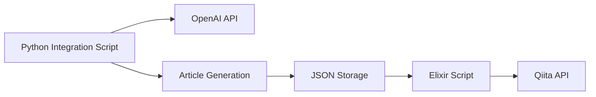

# AI Article Generator & Publisher

🤖 **AI-powered article generation and publishing system developed in collaboration with Amazon Q CLI**

An integrated system that automatically generates technical articles using OpenAI API and publishes them to Qiita. With multiple topic input methods and 5 article templates, you can efficiently create high-quality technical articles.

## ✨ Key Features

- 🎯 **5 Article Templates** (tutorial, tips, deep-dive, comparison, troubleshooting)
- 📝 **3 Topic Input Methods** (argument, file, interactive)
- 🤖 **OpenAI Model Selection** (gpt-4o-mini to gpt-4o)
- 🔗 **Python-Elixir Integration** for robust publishing system
- ⚡ **Flexible Workflow** (generation-only, publish-only options)
- 🛡️ **Secure Environment Variable Management**

## 🚀 Quick Start

```bash
# Basic article generation and publishing
python generate_and_publish.py "How to use Elixir GenServer"

# Generate article with specific template
python generate_and_publish.py "React Hooks Best Practices" --template tips --lang JavaScript

# Use detailed topic from file
python generate_and_publish.py --topic-file my_topic.txt --template deep-dive
```

## 📋 Requirements

### System Requirements

- **Python**: 3.13.5 or higher
- **Elixir**: 1.18.3 or higher (dependencies managed automatically)
- **Erlang/OTP**: 27 or higher
- **OS**: macOS, Linux, Windows

### API Keys

- **OpenAI API Key**: For article generation
- **Qiita Access Token**: For article publishing

## 🛠️ Setup

### 1. Clone Repository

```bash
git clone https://github.com/TORIFUKUKaiou/ai-article-generator.git
cd ai-article-generator
```

### 2. Python Environment Setup

```bash
# Create virtual environment
python -m venv venv
source venv/bin/activate  # Windows: venv\Scripts\activate

# Install dependencies
pip install -r requirements.txt
```

### 3. Environment Variables Configuration

```bash
# Create .env file in project root
echo "QIITA_ACCESS_TOKEN=your_qiita_access_token_here" > .env

# Create python/.env file
cp python/.env.sample python/.env
# Edit python/.env file to set OpenAI API Key
```

## 📖 Usage

### Basic Usage

```bash
# Activate virtual environment
source venv/bin/activate

# Basic article generation and publishing
python generate_and_publish.py "Your Topic"
```

### Topic Input Methods

#### 1. Argument Specification (Multi-line Support)

```bash
# Single-line topic
python generate_and_publish.py "Introduction to Elixir Concurrency"

# Multi-line topic
python generate_and_publish.py "Introduction to Elixir Concurrency

From basic concepts of Actor Model and Task
to practical production use cases,
explained step by step"
```

#### 2. File Specification

```bash
# Read topic from file
python generate_and_publish.py --topic-file sample_topic.txt --template deep-dive
```

#### 3. Interactive Input

```bash
# Interactive input
python generate_and_publish.py --interactive --template tutorial
```

### Article Templates

| Template | Description | Target Audience | Length |
|----------|-------------|-----------------|--------|
| `tutorial` | Beginner-friendly tutorials | Beginner engineers | Long |
| `tips` | Practical tips and tricks | Intermediate engineers | Medium |
| `deep-dive` | In-depth technical explanations | Advanced engineers | Long |
| `comparison` | Technology comparisons | All engineers | Medium |
| `troubleshooting` | Problem-solving guides | Working engineers | Medium |

### Available OpenAI Models

| Model | Description | Quality | Cost | Use Case |
|-------|-------------|---------|------|----------|
| `gpt-4o-mini` | Lightweight GPT-4o (default) | Good | Low | General article generation |
| `gpt-4o` | Latest GPT-4 Optimized | Highest | High | High-quality articles, complex topics |
| `gpt-4-turbo` | GPT-4 Turbo | High | Medium | Balanced approach |

## 🏗️ Architecture



### Technology Stack

- **Python 3.13+**: Article generation, integration control
- **Elixir 1.18+**: Qiita API integration, publishing (auto-managed dependencies)
- **OpenAI API**: GPT-4 series models for article generation
- **Qiita API v2**: Article publishing and management

## 📊 Results

Examples of articles generated by this system:

- [Introduction to Elixir Concurrency - Understanding Actor Model and Task](https://qiita.com/torifukukaiou/private/41519580153024ed0bfc)
- [Learning Functional Programming Basics and Practice with Elixir](https://qiita.com/torifukukaiou/private/34bb4ff56d2e6c4c9dfa)

**12+ high-quality articles generated and published**

## 📚 Documentation

- **[Detailed Usage Guide](docs/USAGE.md)**: Comprehensive usage instructions and options
- **[Development Story](docs/amazon_q_development_article.md)**: Record of collaborative development with Amazon Q CLI

## 🤝 Development Background

This project was born through collaborative development with **Amazon Q CLI**. As a practical example of AI-assisted development, it features:

- 🤖 **Multi-AI Collaboration**: Amazon Q CLI + GitHub Copilot + Gemini
- 🔄 **Iterative Improvement**: Evolution from prototype to production system
- 📝 **Complete Documentation**: Comprehensive record of development process
- 🛠️ **Production Quality**: Actually usable system quality

## 🎯 Future Plans

- **Image Generation**: Integration with DALL-E API
- **Multi-language Support**: English article generation
- **Other Platforms**: Support for Zenn and other platforms
- **Scheduled Publishing**: Automated periodic article posting

## 🐛 Troubleshooting

### Common Issues

1. **Environment Variable Error**: Set API Key in `python/.env` file
2. **Virtual Environment Error**: Activate with `source venv/bin/activate`
3. **Publishing Error**: Check Qiita Access Token configuration

### Mac Environment Recommendations

**Using VSCode Terminal is recommended**. Mac Terminal may experience forced termination when using Amazon Q CLI.

## 📄 License

MIT License - See [LICENSE](LICENSE) file for details.

## 🙏 Acknowledgments

- **Amazon Q CLI**: As collaborative development partner
- **OpenAI**: High-quality article generation API
- **Qiita**: Article publishing platform
- **Elixir Community**: Especially [fukuoka.ex](https://qiita.com/organizations/fukuokaex)

## 🔗 Related Links

- [Amazon Q CLI Official Documentation](https://docs.aws.amazon.com/amazonq/)
- [OpenAI API Documentation](https://platform.openai.com/docs)
- [Qiita API Documentation](https://qiita.com/api/v2/docs)
- [Qiita Tech Sprint 2025](https://qiita.com/tech-festa/2025/tech-sprint)

---

**We hope this project serves as a reference for engineers interested in AI-assisted development. Questions and contributions are welcome!** 🚀
