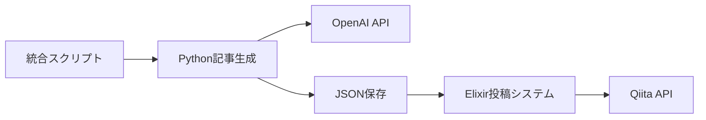

# Amazon Q CLIと一緒に作る！AI記事生成・投稿システム開発記

## はじめに

「AIで記事を自動生成してQiitaに投稿できたら便利だな...」

そんな思いつきから始まった開発が、Amazon Q CLIとのペアプログラミングによって、わずか数時間で本格的なシステムに進化しました。この記事では、実際の開発過程を振り返りながら、AI支援開発の魅力と技術的な詳細を紹介します。

## 完成したシステム概要

最終的に完成したのは、以下の機能を持つ統合システムです：

```bash
# 一行で記事生成・投稿が完了
python generate_and_publish.py "Elixirの並行処理入門" --template tutorial --lang Elixir --model gpt-4o
```

### 主な機能
- **5つの記事テンプレート**（tutorial, tips, deep-dive, comparison, troubleshooting）
- **OpenAIモデル選択**（gpt-4o-mini〜gpt-4o）
- **Python-Elixir連携**による堅牢な投稿システム
- **柔軟なワークフロー**（生成のみ、投稿のみも可能）

## 開発の始まり：「記事生成だけでも...」

### 最初のリクエスト
```
私: 「OpenAI APIを使って技術記事を生成するPythonスクリプトを作りたい」
```

Amazon Q CLIは即座に基本的な構造を提案してくれました：

```python
class ArticleGenerator:
    def __init__(self, api_key: Optional[str] = None):
        self.client = OpenAI(api_key=api_key or os.getenv("OPENAI_API_KEY"))
    
    def generate_article(self, topic: str, target_audience: str = "エンジニア"):
        # 記事生成ロジック
```

**ここでの学び**: AIは基本構造を素早く提供してくれるので、アイデアを形にするスピードが格段に上がります。

## 進化の過程：「もっと高品質な記事を」

### プロンプトエンジニアリング
単純な記事生成では物足りなくなり、「1000いいねを獲得する記事」を目指すことに。

```
私: 「1000いいねを獲得するような高品質な記事にしたい」
```

Amazon Q CLIが提案したプロンプト改善：

```python
system_prompt = """あなたは1000いいねを獲得する技術記事を書く専門家です。

【1000いいね獲得のポイント】:
- 実用的で即座に使える具体的なコード例
- 初心者にも分かりやすい丁寧な解説
- 「なぜそうするのか」の理由も説明
- ハマりやすいポイントと解決策を含める
- 読者の「知りたかった！」に応える内容
"""
```

**ここでの学び**: AIとの対話を通じて、プロンプトを段階的に改善できます。一人では思いつかない視点も得られました。

## 技術的な挑戦：Python-Elixir連携

### 「Qiitaに自動投稿もしたい」
記事生成だけでは満足できず、投稿の自動化も要求しました。

```
私: 「ElixirでQiita APIクライアントを作って、Pythonと連携させたい」
```

Amazon Q CLIは即座にElixirのHTTPクライアント実装を提案：

```elixir
defmodule QiitaPublisher.ArticleService do
  def publish_article(access_token, article_data) do
    client = Req.new(
      base_url: "https://qiita.com/api/v2",
      headers: [
        {"Authorization", "Bearer #{access_token}"},
        {"Content-Type", "application/json"}
      ]
    )
    
    Req.post(client, url: "/items", json: article_data)
  end
end
```

### 連携の仕組み
1. **Python**: OpenAI APIで記事生成 → JSON保存
2. **Elixir**: JSONファイル読み込み → Qiita API投稿

```python
# Python側
generator.save_article_json(article, "generated_article.json")

# Elixir側（統合スクリプトから呼び出し）
QiitaPublisher.PythonBridge.publish_from_json(access_token, json_path)
```

**ここでの学び**: 異なる言語間の連携も、AIの提案により自然に実現できました。

## 実際の問題解決：タグ解析のバグ

開発中に遭遇した実際の問題と解決過程を紹介します。

### 問題発生
```
🏷️  Tags: [nil, nil, nil, nil, nil]
```

タグ名が`nil`になってしまう問題が発生。

### 問題分析
```
私: 「タグがおかしいので変更してみて。」
```

Amazon Q CLIは即座に原因を特定：

```python
# 問題のあるコード
tag_names = [tag.strip() for tag in tag_str.split(',')]

# 修正後
tag_str = tag_str.strip('[]')  # 角括弧を除去
tag_names = [tag.strip().strip('[]') for tag in tag_str.split(',')]
tag_names = [name for name in tag_names if name and len(name) > 0]
```

**ここでの学び**: バグの説明をすると、AIが原因を特定して修正案を提示してくれます。デバッグ効率が大幅に向上しました。

## システムの進化：統合スクリプトの誕生

### 「パラメータで記事の方向性を指定したい」
個別のスクリプトでは使いにくくなり、統合的なソリューションを要求：

```
私: 「スクリプトにしてほしい。いろいろな記事を作成できるようにパラメータで記事の方向性とかを指定できるようにしてほしい。」
```

Amazon Q CLIが提案した統合スクリプト：

```python
ARTICLE_TEMPLATES = {
    "tutorial": {
        "description": "初心者向けチュートリアル記事",
        "target_audience": "初心者エンジニア",
        "article_length": "長い",
        "style": "丁寧で段階的な解説"
    },
    "tips": {
        "description": "実用的なTips・小技記事", 
        "target_audience": "中級エンジニア",
        "article_length": "中程度",
        "style": "すぐに使える実践的な内容"
    },
    # ... 他のテンプレート
}
```

### 柔軟な実行オプション
```bash
# 基本的な使用
python generate_and_publish.py "ElixirのGenServerの使い方"

# 詳細指定
python generate_and_publish.py "React Hooksの活用法" \
  --template tips \
  --lang JavaScript \
  --model gpt-4o

# 段階的実行
python generate_and_publish.py "Docker入門" --generate-only
python generate_and_publish.py --publish-only
```

## 技術的な詳細解説

### アーキテクチャ概要



### 環境変数の設計
セキュリティと使いやすさを両立する設計：

```bash
# プロジェクトルート/.env（統合スクリプト用）
QIITA_ACCESS_TOKEN=your_token

# python/.env（記事生成用）
OPENAI_API_KEY=your_key
```

### エラーハンドリング
実用的なシステムには堅牢なエラー処理が必要：

```python
def setup_environment():
    """環境設定の確認"""
    if not env_file.exists():
        print("⚠️  .envファイルが見つかりません（オプション）")
    
    if not venv_path.exists():
        print("❌ Python仮想環境が見つかりません")
        print(f"   以下のコマンドで作成してください:")
        return False
```

## AI同士の協働：GitHub Copilotによるさらなる改善

システムが完成した後、さらなる品質向上を求めて**GitHub Copilot**にも協力を求めました。

### 「プロンプトをもっと良くできないか？」

Amazon Q CLIで作成したプロンプトを、GitHub Copilotに改善してもらいました：

```
私: 「github copilotにたのんでプロンプトを改善してもらった。どうだろう？」
```

### GitHub Copilotの改善提案

#### 1. **トークン数の増加**
```python
# 改善前
max_tokens=2000

# 改善後
max_tokens=4000  # トークン数を増やす
```

#### 2. **記事長ガイドの詳細化**
```python
# 改善前
"短い": "800-1200文字程度"
"中程度": "1500-2500文字程度"
"長い": "3000-4000文字程度"

# 改善後
"短い": "1000-1500文字程度（基本的な説明と簡単な例）"
"中程度": "2000-3000文字程度（詳細な説明と複数の例）"
"長い": "3500-5000文字程度（網羅的な説明と実践的な例）"
```

#### 3. **プロンプト構造の大幅改善**
```python
# 改善後のプロンプト構造
【記事構成の要件】:
1. **魅力的なタイトル**: 具体的で読みたくなるタイトル
2. **はじめに**: 
   - この記事で何が学べるか
   - なぜこの技術が重要か
   - 記事の対象読者
3. **本文**: 
   - 段階的に理解できる構成
   - 実際に動くコード例（コメント付き）
   - つまずきやすいポイントの解説
   - 実践的な使用例
4. **まとめ**: 
   - 学んだことの要点
   - 次のステップの提案

【コード例の要件】:
- 実際に動作するコード
- 適切なコメント
- エラーハンドリングを含む
- 実践的な使用例
```

### 改善効果の検証

改善されたプロンプトでテスト実行：

```bash
python generate_and_publish.py "Elixirのパイプライン演算子活用術" --template tips --lang Elixir --generate-only
```

**結果**:
- **記事長**: 2,018文字（改善前より充実）
- **構成**: より体系的で読みやすい構造
- **コード品質**: エラーハンドリングを含む実践的な例
- **学習効果**: 段階的で理解しやすい内容

### AI協働開発の新たな次元

この体験で分かったのは、**複数のAIツールを組み合わせることで、さらに高品質な成果物が得られる**ということです：

- **Amazon Q CLI**: システム全体の設計・実装・問題解決
- **GitHub Copilot**: 既存コードの品質向上・最適化

**ここでの学び**: AIツール同士も協働できる時代。一つのAIで満足せず、複数のAIの強みを活かすことで、より良い結果を得られます。

## AI支援開発の魅力

### 1. **高速プロトタイピング**
アイデアから動作するプロトタイプまでの時間が劇的に短縮されます。

### 2. **技術的な壁の突破**
知らない技術（今回はElixir）でも、AIの支援により実装できました。

### 3. **コード品質の向上**
AIが提案するコードは、ベストプラクティスに従っていることが多く、学習効果も高いです。

### 4. **問題解決の効率化**
バグや課題に遭遇した際の解決スピードが格段に向上します。

### 5. **複数AI協働の可能性**
Amazon Q CLI + GitHub Copilotの組み合わせにより、さらなる品質向上を実現。一つのAIでは得られない相乗効果を体験しました。

## 実際の使用感

### 生成される記事の品質
```bash
python generate_and_publish.py "Elixirの並行処理入門" --template tutorial --lang Elixir
```

**結果**:
- タイトル: Elixirの並行処理入門 - 簡単に使えるActorモデルとTaskを理解しよう
- 本文長: 2,448文字
- 適切なタグ付け
- 実用的なコード例を含む高品質な記事

### パフォーマンス
- **記事生成時間**: 約30-60秒（モデルにより変動）
- **投稿処理**: 数秒
- **総実行時間**: 1分程度

## 今後の展望

### 機能拡張のアイデア
- **画像生成**: DALL-E APIとの連携
- **多言語対応**: 英語記事の生成
- **SEO最適化**: メタデータの自動生成
- **スケジュール投稿**: 定期的な記事投稿

### 他プラットフォーム対応
- **Zenn**: Zenn APIとの連携
- **note**: note APIとの連携
- **Medium**: Medium APIとの連携

## まとめ

Amazon Q CLIとのペアプログラミング、そしてGitHub Copilotによる品質向上により、単純なアイデアが本格的なシステムに進化しました。AI支援開発の魅力は以下の点にあります：

1. **アイデアの高速実現**: 思いついたらすぐに形にできる
2. **技術的制約の突破**: 知らない技術でも実装可能
3. **継続的な改善**: 対話を通じた段階的な品質向上
4. **学習効果**: AIとの協働で新しい知識を獲得
5. **AI協働の相乗効果**: 複数のAIツールを組み合わせることで、さらなる品質向上を実現

### 開発のコツ
- **具体的な要求**: 「〜したい」を明確に伝える
- **段階的な改善**: 一度に完璧を求めず、徐々に改良
- **積極的な質問**: 分からないことは遠慮なく聞く
- **実験精神**: 新しいアイデアを恐れずに試す
- **複数AI活用**: 一つのAIに固執せず、適材適所で使い分ける

### AI協働開発の未来

今回の体験で、**AI同士の協働**という新しい可能性も見えてきました：

- **Amazon Q CLI**: 包括的な開発支援・問題解決
- **GitHub Copilot**: コード品質向上・最適化提案
- **ChatGPT/Claude**: 特定分野の深い知識提供

AI支援開発は、プログラマーの創造性を制限するものではなく、むしろ拡張するツールです。Amazon Q CLIのような優秀なAIパートナーと一緒に、あなたも次の革新的なプロジェクトを始めてみませんか？

## 参考リンク

- [完成したプロジェクト（GitHub）](#) ※公開予定
- [Amazon Q CLI公式ドキュメント](https://docs.aws.amazon.com/amazonq/)
- [OpenAI API Documentation](https://platform.openai.com/docs)
- [Qiita API v2](https://qiita.com/api/v2/docs)

---

**この記事が、AI支援開発に興味を持つエンジニアの参考になれば幸いです。質問やコメントをお待ちしています！** 🚀
